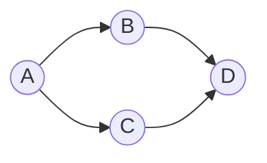

# Simple Map Implementation Using Dijkstra's Algorithm

## Latar Belakang

Algoritma Dijkstra (yang ditemukan oleh seorang programmer Edsger Dijkstra) adalah sebuah greedy algorithm yang dipakai dalam memecahkan permasalahan jarak terpendek (shortest path problem) untuk sebuah graf berarah (directed graph) dengan bobot-bobot (weight) edge yang bernilai nonnegatif [0, ∞]. Input dari algoritma ini adalah sebuah graf berarah yang juga berbobot (weighted directed graph) ***G*** dan sebuah titik asal ***s*** dalam himpunan garis ***V***.

Misalnya, bila titik dari sebuah graf melambangkan kota-kota dan bobot garis melambangkan jarak antara kota-kota tersebut, algoritma Dijkstra dapat digunakan untuk menemukan jarak terpendek antara dua kota tersebut.

Biaya (cost) dari sebuah garis dapat dianggap sebagai jarak antara dua simpul, yaitu jumlah jarak semua garis dalam jalur tersebut. Untuk sepasang titik ***s*** dan ***t*** dalam ***V***, algoritma ini menghitung jarak terpendek dari ***s*** ke ***t***.

Salah satu implementasi algoritma Dijkstra di dunia nyata yang paling terkenal adalah pada penentuan jarak terpendek di Google Maps.
Implementasi lainnya adalah pada aplikasi social networking, jaringan telepon, IP routing, jadwal penerbangan, desain file server, dan jalur robotik.

## Deskripsi Tugas

Terdapat beberapa node dalam sebuah graf. Cari lintasan terpendek dari sebuah node ke sebuah node lainnya dengan menggunakan algoritma Dijkstra.

Deskripsi aplikasi:
1. Dibuat menggunakan bahasa Python, Java, Go, atau C++
2. Untuk GUI (bonus) dibebaskan menggunakan bahasa atau framework apapun
3. Model graf dapat disimpan dalam format `txt` atau `json` (format bebas)

Deskripsi cara kerja aplikasi:
1. User dapat mengupload file berisi kumpulan node dan edge yang menghubungkannya beserta bobot pada setiap edge
2. Program dapat menampilkan kumpulan node dan edge tersebut
3. Pengguna dapat memilih dua buah node. Node pertama yang dipilih adalah source dan node kedua adalah destination
4. Program kemudian dapat menampilkan lintasan terpendek dari node pertama ke node kedua tersebut
5. Tampilkan pula banyaknya iterasi dan lamanya program berjalan

## Constraints

1. Weighted Directed graph
2. n(node) >= 3
3. n(edge) >= 2
4. w(edge) >= 0

## Bonus

1. Implementasi menggunakan GUI dalam bentuk sebuah aplikasi web/desktop (750)
	a. Program dapat menampilkan kumpulan node dan edge di UI website
	b. Pengguna dapat mengeklik dua buah node. Node pertama yang diklik adalah source dan node kedua adalah destination
	c. Program kemudian dapat menampilkan lintasan terpendek dari node pertama ke node kedua tersebut (bisa implementasi button juga buat memulai programnya)
2. Keindahan desain aplikasi yang dibuat (250)
3. Step-step dari node awal ke node tujuan (Tampilkan pula bobot setiap node per step) (250)

## Langkah Pengerjaan

1. Fork repo ini dan undang `@slarkdarr` ke repo hasil fork kalian
2. Disarankan untuk melakukan push secara berkala
3. Jika telah selesai mengerjakan, kirim message ke LINE `@daffa_ananda` untuk penjadwalan demo
4. Ketika melakukan demo, source code di local kalian dengan source code di GitHub haruslah sama

## Poin Total

- Spesifikasi wajib : 1750 (Algoritma yang dibuat sesuai dan program berjalan sesuai cara kerja program yang telah disebutkan)
- Spesifikasi bonus : 1250 (750 poin untuk implementasi GUI yang memenuhi prosedur yang telah disebutkan; 250 poin untuk keindahan GUI; 250 poin untuk penampilan langkah-langkah dari node awal ke node tujuan secara tepat)

## Contoh Graf

## Kompleksitas

Time Complexity:  `O(E Log V)`
Space Complexity:  `O(V)`
### where, E is the number of edges and V is the number of vertices.
Kompleksitas hanya untuk benchmark ya

## Catatan Tambahan
- Jika ada pertanyaan, silahkan LINE ke `@daffa_ananda`
- Perubahan spesifikasi dapat terjadi sewaktu-waktu dan akan diumumkan di grup LINE
- Spesifikasi wajib harus selesai sebelum spesifikasi bonus dikerjakan
